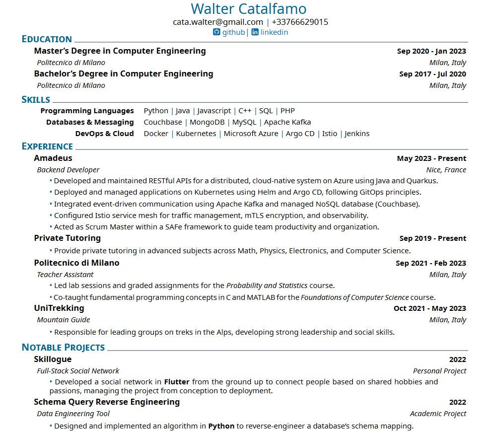

# Modern LaTeX CV

This repository contains the source code for my personal curriculum vitae, created using LaTeX and the `muratcan_cv` class. It features a clean, modern, single-column template perfect for software developers and engineers.

## Preview



---

## Template and Inspiration

This CV is built upon the **`muratcan_cv`** LaTeX class. The design and structure were inspired by the excellent work found in this [Overleaf project](https://www.overleaf.com/project/627224a4c2dc8e6361a77250).

## Requirements

To compile this CV, you will need a working LaTeX distribution. Common distributions include:

* [TeX Live](https://www.tug.org/texlive/) (Windows, Linux, macOS)
* [MiKTeX](https://miktex.org/) (Windows)
* [MacTeX](https://www.tug.org/mactex/) (macOS)

The template also requires the **Noto** font family, which is typically included with modern TeX distributions or can be downloaded from Google Fonts.

## Compilation

Because this template uses the `fontspec` package to handle custom fonts, it **must** be compiled with the **XeLaTeX** engine.

From your terminal, navigate to the project directory and run the following command:

```bash
xelatex cv.tex
```

You may need to run the command a second time to ensure all cross-references (if any) are correctly generated.

### Troubleshooting

> **Error:** `Fatal Package fontspec Error: The fontspec package requires either XeTeX or LuaTeX.`

This error means you are trying to compile with the wrong engine (e.g., `pdflatex`). Ensure your LaTeX editor's build configuration is set to **XeLaTeX**.

## Customization

You can easily customize the CV by editing the `cv.tex` file:

* **Personal Information:** All personal details (name, address, email, social links) are set in the preamble using `\setname`, `\setmail`, etc.
* **Theme Color:** The theme color can be changed by modifying the `\setthemecolor{...}` command. Valid color names (e.g., `DarkRed`, `OliveGreen`, `RoyalBlue`) can be found in the `dvipsnames` color package documentation.
* **Content:** The sections for Education, Skills, Experience, and Projects can be edited directly in the document body using the custom commands `\datedexperience`, `\explanation`, and `\createskill`.
